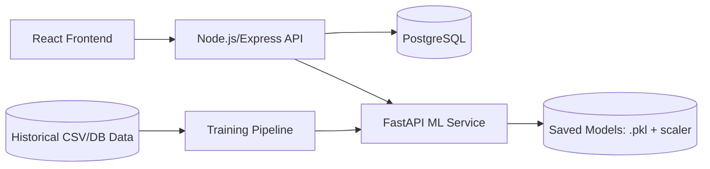

# EduMetrics — Machine Learning Based Student Performance Prediction & Academic Analytics

EduMetrics is a role-based web platform for students, teachers, and admins that predicts academic performance and visualizes risk/analytics for early intervention.

## Architecture



## Repository Structure

```text
.
├── frontend/             # React + Tailwind + Recharts
├── backend/              # Express + Sequelize + JWT RBAC
├── ml-service/           # FastAPI + scikit-learn training/inference
└── docker-compose.yml
```

## Features Implemented

- **Student/Teacher/Admin auth** with JWT and role checks
- **Core models**: User, Student, Subject, AcademicRecord, Prediction
- **CRUD APIs** for students, subjects, academic records
- **Prediction API** (`/api/predictions/generate`) that calls ML service over HTTP
- **Analytics APIs**:
  - `GET /api/analytics/class/:subjectId`
  - `GET /api/analytics/student/:studentId`
- **ML service**:
  - `POST /predict`
  - `GET /health`
  - `POST /retrain` (API key protected)
  - dataset generator + training script
- **Frontend dashboards**:
  - Student dashboard (prediction, risk badge, trend, recommendations)
  - Teacher dashboard (filters, charts, CSV preview)
  - Admin dashboard (stats, user/subject tables, retrain trigger UI)

## API Endpoints (Backend)

- `POST /api/auth/register`
- `POST /api/auth/login`
- `GET|POST|PUT|DELETE /api/students`
- `GET|POST|PUT|DELETE /api/subjects`
- `GET|POST|PUT|DELETE /api/records`
- `POST /api/predictions/generate`
- `GET /api/analytics/class/:subjectId`
- `GET /api/analytics/student/:studentId`

## Local Development

### 1) Backend

```bash
cd backend
cp .env.example .env
npm install
npm run dev
```

### 2) ML Service

```bash
cd ml-service
python -m venv .venv
source .venv/bin/activate
pip install -r requirements.txt
python generate_sample_data.py
python train.py --data data/sample_students.csv
uvicorn main:app --reload --port 8000
```

### 3) Frontend

```bash
cd frontend
npm install
npm run dev
```

## Docker Setup

```bash
docker compose up --build
```

Services:
- Frontend: `http://localhost:3000`
- Backend: `http://localhost:5000`
- ML service: `http://localhost:8000`
- PostgreSQL: `localhost:5432`

## Environment Variables

- Backend: `PORT`, `DB_HOST`, `DB_PORT`, `DB_NAME`, `DB_USER`, `DB_PASSWORD`, `JWT_SECRET`, `ML_SERVICE_URL`
- ML Service: `ML_ADMIN_API_KEY`, `MODEL_VERSION`
- Frontend: `VITE_API_URL`

## Screenshots

- `docs/screenshots/student-dashboard.png` (placeholder)
- `docs/screenshots/teacher-dashboard.png` (placeholder)
- `docs/screenshots/admin-dashboard.png` (placeholder)
